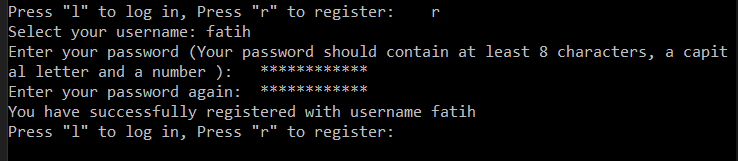
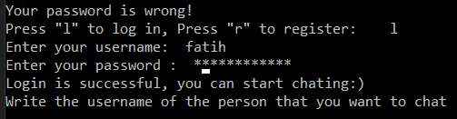

# ULB---ELEC-H417---Chat_Application

## Intro
This repository is created to represent our project work. The repository includes server.py, client.py, the project report and read.me file.

### Used Compiler & Compatibility
Pycharm 2021.2.2 (community Edition) is used throughout this project. We highly recommended you to use the same or most similar version. Please check Google to learn how to import libraries or you can watch the following video: https://www.youtube.com/watch?v=KEIvXwUm8iE
In both server.py and client.py files, a variable 'IP' is used. It is the IPv4 address of my PC. To not face with an error, you should change this variable with your own IP address. You can learn it by typing "ipconfig" on Windows PCs or "ifconfig" on Linux based PCs.
### Used Libraries

We have used the following libraries in the project:
- random: To select random keys for clients
- socket: To create sockets for communication
- pwinput: To keep the passwords secret while entering them
- bcrypt: To keep passwords in hashlib
- re
- threading: To run some functions in server.py simultaneously for different clients 

## How to use
You can check the following link to see how to use these codes and run the application: https://youtu.be/8cMZI310ZVo
 
 Order of the program starts with running the server code server.py.
 
 After the server get ready, user can open the client code cliet.py. 
 
 The message is {'Press "l" to log in or press "r" to new registration or press "c" to close the connection:'}. Now, we are new user so we need to register first. In order to register write;
 
 - r 
 
 then, choose your user name and password. Your password should contain at least 8 characters, a capital letter and a number otherwise, the user starts from beginning.
 
  

 
 In order to login this time type 
 
 - l  
 Enter username and password.
 
 Client should be careful while writing password since, the server check his password and username.
 
 
 
 Now open another client.py. Register and login with a diiferent username.
 
Program is not working properly so you need to follow  these steps to send message between clients. Let's say first username is client1 and second user is client2.

> On client1 window, type client2 and enter.

> On client2 window, type client1 and enter.

Press enter on client1 command window and then, press enter on client2. This is necessary for public key sharing.

In order to send message from client1 to client to;

> On client1 window press

- 1

Write your message.

> On client2 window press

- 0

## References
- https://pythonprogramming.net/client-chatroom-sockets-tutorial-python-3/?completed=/server-chatroom-sockets-tutorial-python-3/
- https://medium.com/@sadatnazrul/diffie-hellman-key-exchange-explained-python-8d67c378701c
- https://medium.com/@sadatnazrul/diffie-hellman-key-exchange-explained-python-8d67c378701c
- https://howtodoinjava.com/python/modules/python-bcrypt-hash-password/
- https://stackoverflow.com/questions/41117733/validation-of-a-password-python
- https://pythonprogramming.net/server-chatroom-sockets-tutorial-python-3/
- https://pythonprogramming.net/server-chatroom-sockets-tutorial-python-3/
- https://stackoverflow.com/questions/41117733/validation-of-a-password-python
- https://howtodoinjava.com/python/modules/python-bcrypt-hash-password/
- https://www.geeksforgeeks.org/python-program-to-convert-a-list-to-string/
- https://www.geeksforgeeks.org/python-get-dictionary-keys-as-a-list/
- https://www.techwithtim.net/tutorials/socket-programming/
